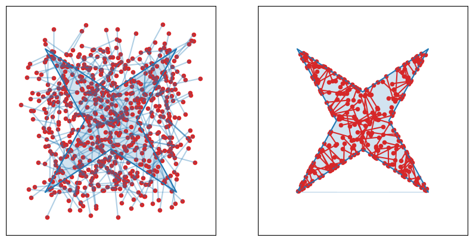

Building Estimators
===================

Given a collection of fibers, we provide several utility functions to construct the integral estimators for a problem of interest. 
In most applications we are interested in parameterizing some kind of geometry. 
Our estimators support two ways of parameterizing that geometry. 

Polyhedra 
---------
In many cases of interest the function to be integrated is piecewise affine (often piecewise constant). 
This subsumes the very common case of integrands containing an indicator function :math:`\mathbb{I}`, which arises in differentiable rendering, 
topology optimization, and many geometric computations. 
Since it is so common, we provide a fast path for the special case where the geometric primitives of interest (i.e. the set over which the indicator function is nonzero) are 
polyhedra. 

In this case, one can use ``fibermc.estimators.estimate_hull_area``, which estimates (relative to the cumulative length of the provided fibers) the area within 
a given polyhedron. Polyhedra are represented using their vertices, which are expected in counter-clockwise order. 

.. code-block:: python 

   import jax.numpy as np
   from jax_typing import Float, Array

   from fibermc.estimators import estimate_hull_area

    vertices: Float[Array, "v 2"] = np.array(
        [
            [0.0, 0.0],
            [0.5, 0.3],
            [1.0, 0.0],
            [0.7, 0.5],
            [1.0, 1.0],
            [0.5, 0.7],
            [0.0, 1.0],
            [0.3, 0.5],
        ]
    )

    fibers: Float[Array, "n 2 2"] = ... 
    area_estimate: Float[Array, ""] = estimate_hull_area(fibers, vertices)

The way this works is we essentially sum the length of fiber which lies within the shape of interest, illustrated below. 

For more exploratory applications, we provide an extra utility to interoperate with Shapely. 
Note that these methods cannot be JIT compiled so performance-critical applications should call the lower-level utilies. 
Checkout examples for use of the high level Shapely interoperable functions. 

Flexible Geometry via Implicit Functions
----------------------------------------

.. note:: 
   
   This section is under construction! Check back soon. 

The most general way to parameterize geometry for our estimators involves formulating a function whose zero-sublevel set corresponds with the shape/geometry of interest. 
We call this scalar-valued function which implicitly defines our shapes a 'field', and we provide estimators for the integral associated with the field. 
A simpler way to think about the zero sublevel set convention is: we expect that the field takes on negative values in the interior of the shape being parameterized. 
So the task is simply to construct a function. 
Many examples are provided in our Examples section. 

.. code-block:: python 

   import jax.numpy as np
   from jax_typing import Float, Array

   from fibermc.estimators import estimate_field_area

   fibers: Float[Array, "n 2 2"] = ...
   f: Callable[[Float[Array, "2"], Any], Float[Array, ""]] = ... 
   area_estimate = estimate_field_area(f, fibers, f_args) 