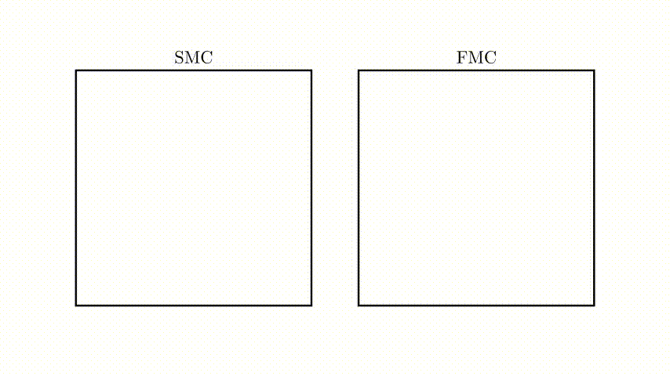
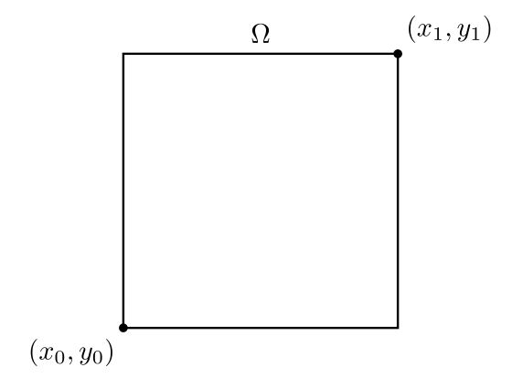

Sampling Fibers 
===============

Much like simple Monte Carlo depends on appropriately defined 'random' points in the domain of a function of interest to estimate an associated integral, FMC estimators take as argument a collection of random line segments (fibers) in an appropriately defined domain. 
Whereas in SMC the sampling 'atom' is a point with no spatial extent, in FMC the atom is a line segment with nonzero but finite spatial extent (length). 

We currently support only rectilinear domains, although it would be relatively straightforward to generalize this in many cases. For a rectangular domain which is illustrated pictorially below, we can use ``sample`` to sample a collection of fibers. 

.. code-block:: python 

   import jax.numpy as np 
   import jax.random as npr
   from jaxtyping import Array, Float

   import fibermc.estimators as estimators

   domain_boundary = np.array([
         0., # x0
         0., # y0 
         1., # x1 
         1.  # y1 
         ])
   key = npr.PRNGKey(0)
   num_fibers: int = 3 
   fiber_length: float = 1e-02 

   fibers: Float[Array, "n 2 2"] = estimators.sample(
                                                key, 
                                                bounds, 
                                                num_fibers, 
                                                fiber_length
                                          )

